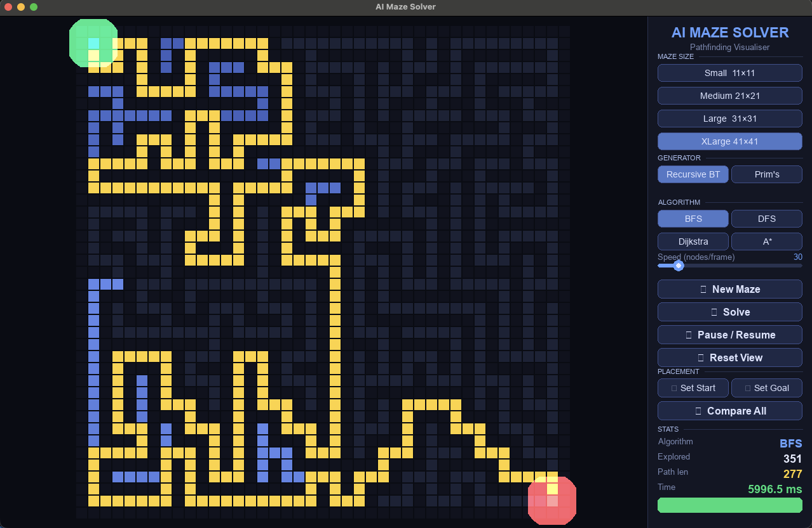
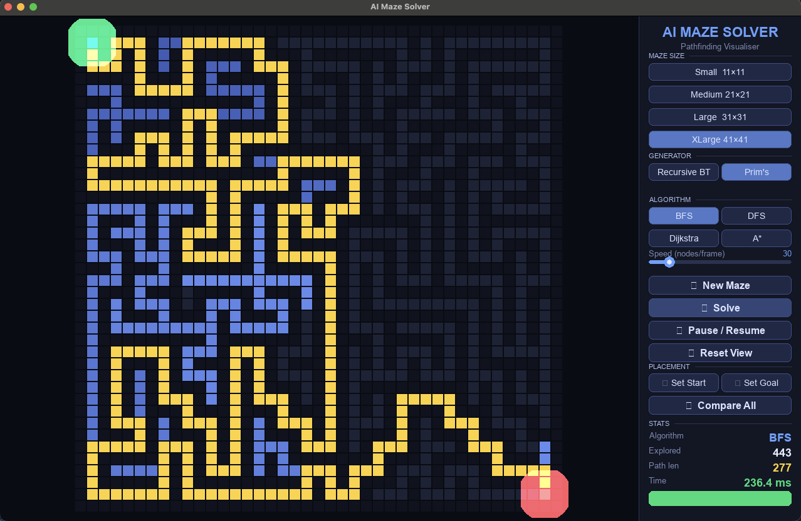

# AI Maze Game Solver (Python + Pygame)

An interactive maze generator + pathfinding visualizer. Generate a maze, pick an algorithm (BFS / DFS / Dijkstra / A*), then watch the search animate step-by-step.

**Features**
- Animated solving (with adjustable speed)
- Two maze generators (Recursive Backtracking, Prim's)
- Move start/goal by clicking cells
- "Compare All" to benchmark all algorithms instantly

## Preview

| Example 1 | Example 2 |
|---|---|
|  |  |

**Color legend**
- Green = Start
- Red = Goal
- Blue gradient = Explored cells (early → late)
- Gold = Final path

## Getting Started

### Requirements
- Python 3.8+
- `pip`

### Install

```bash
pip install -r requirements.txt
```

### Run

```bash
python main.py
```

If `python` points to Python 2 on your machine, use `python3` instead:

```bash
python3 main.py
```

## How to Use (in the app)

1. Pick a **Maze Size** and **Generator** in the sidebar
2. Click **⟳ New Maze** (or press `N`)
3. Pick a pathfinding **Algorithm**
4. Click **▶ Solve** (or press `Enter`)
5. Use the **Speed** slider to speed up / slow down the animation

Optional:
- Click **📍 Set Start** or **🎯 Set Goal**, then click an open cell on the maze canvas
- Click **⚖ Compare All** to run all algorithms instantly (click anywhere to dismiss the comparison panel)

## Controls

| Key | Action |
|---|---|
| `Enter` | Solve using the selected algorithm |
| `Space` | Pause / resume solving |
| `N` | Generate a new maze |
| `R` | Reset view (clears explored/path, keeps the maze) |
| `Esc` | Cancel start/goal placement mode |

## Project Structure

```
AI Maze Game Solver/
├── main.py          # App entry point
├── visualizer.py    # Pygame UI + animation + controls
├── maze.py          # Maze grid + generation algorithms
├── solver.py        # BFS / DFS / Dijkstra / A* implementations
├── requirements.txt # Dependencies
└── assets/          # Screenshots
```

## Maze Generation

| Generator | What it produces |
|---|---|
| Recursive Backtracking | Long corridors, fewer branches (DFS-style carving) |
| Prim's Algorithm | More "branchy" mazes with lots of junctions |

Notes:
- The maze uses **odd dimensions** so walls/paths align cleanly.
- Start defaults near the top-left; goal defaults near the bottom-right.

## Pathfinding Algorithms

| Algorithm | Finds shortest path? | Notes |
|---|:---:|---|
| BFS | ✅ | Shortest path on unweighted grids |
| DFS | ❌ | Often finds a longer path, but explores dramatically |
| Dijkstra | ✅ | Equivalent to BFS here (unit edge costs), but uses cost tracking |
| A* | ✅ | Uses Manhattan distance to focus search toward the goal |

Implementation detail: each algorithm is a Python **generator** that yields intermediate steps so the UI can animate smoothly.

## Dependencies

- `pygame>=2.0.0`

## Troubleshooting

- **No window opens / “no available video device”**: Pygame needs a desktop display. Run locally (not on a headless server).
- **Install problems**: upgrade pip first: `python -m pip install --upgrade pip`, then re-run `pip install -r requirements.txt`.

## License

MIT - Free to use, modiify, and share.
